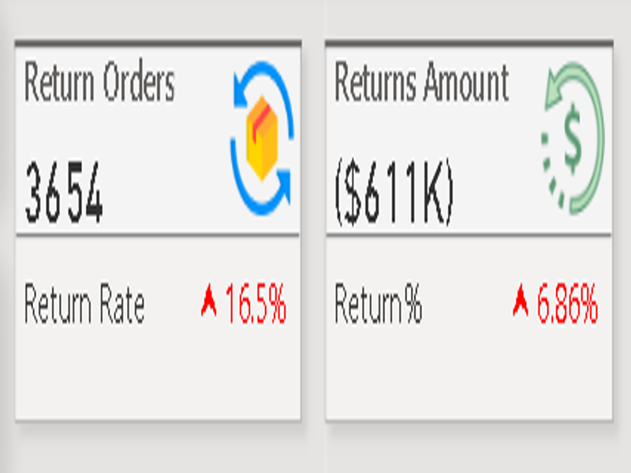
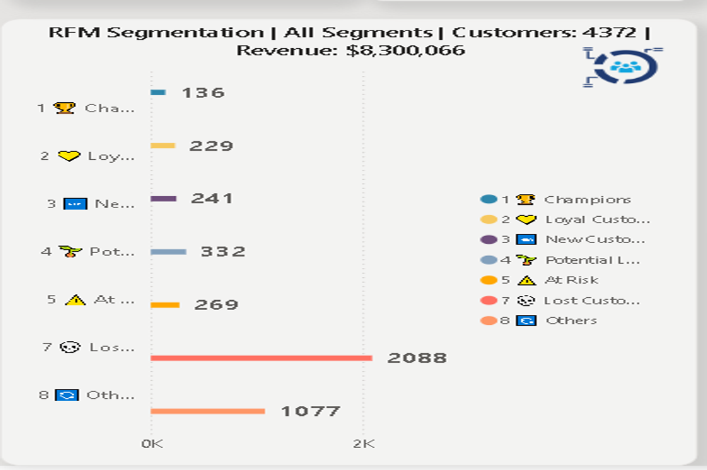
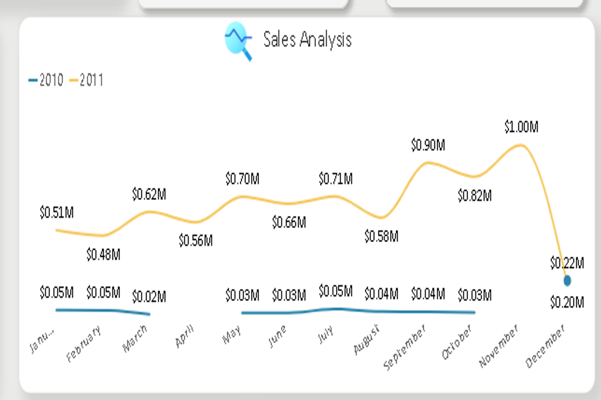
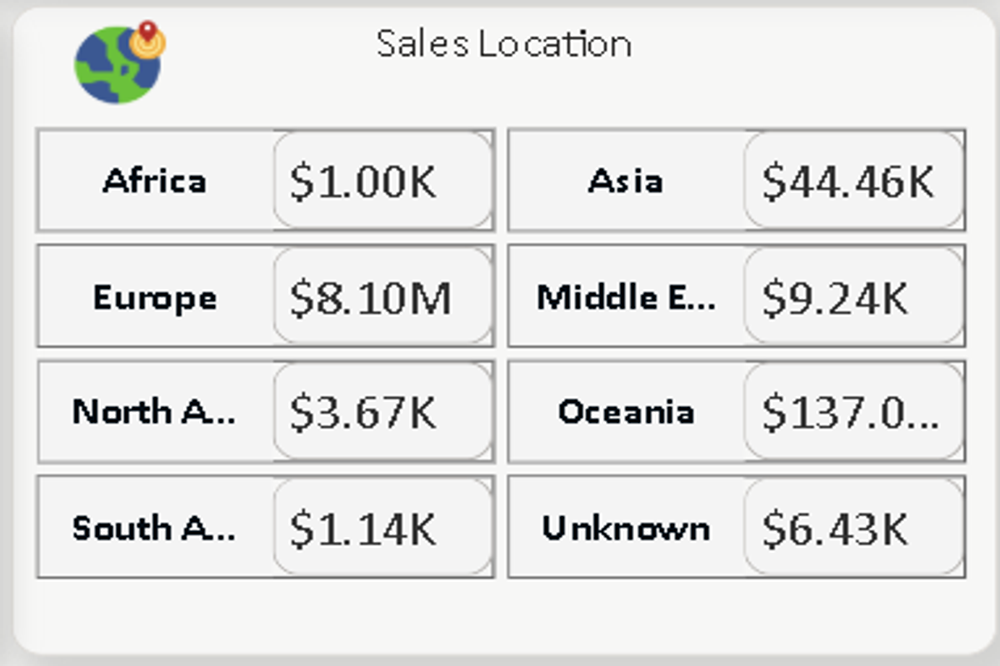
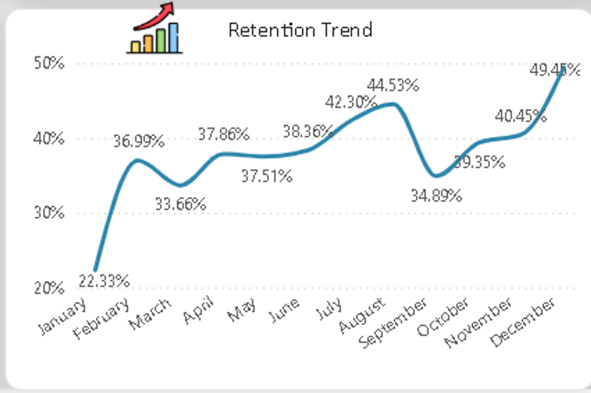

# 💰 E-Commerce Revenue Leakage: From $8.3M to Profitable Growth via RFM Segmentation

**End-to-End Data Analytics Project** | Customer Segmentation | Strategic Business Recommendations

---

## 📌 Executive Summary

Analyzed 22,000+ transactions from 4,372 customers across 3 years to uncover why revenue grew 10x YoY while profitability leaked through returns and geographic concentration. Using Power Query data transformation and RFM (Recency, Frequency, Monetary) segmentation analysis, I discovered that 12% of customers drive 78% of revenue while a 16.5% return rate costs the business $611K annually. Strategic recommendations across return reduction, mid-tier customer upselling, geographic diversification, and whale retention could unlock **$2.1M incremental revenue** and **$152K annual savings**—a combined **$2.25M business impact**.

---

## 🔴 Business Problem

- **Problem:** 16.5% return rate (2x industry average) = $611K annual loss to margins
  - Root Cause: Product quality issues in Category X (22% return rate); delivery partner inconsistency in UK/Germany
  - Business Impact: Eroding profit despite strong revenue growth

- **Problem:** Revenue concentrated in whale customers (12% = 78% of revenue)
  - Root Cause: Mid-tier customer segment undermonetized; new cohorts declining in AOV
  - Business Impact: Single-customer loss = catastrophic risk; untapped $2.1M upselling opportunity

- **Problem:** 98% revenue from Europe only
  - Root Cause: No active expansion into US/APAC; regional logistics costs prohibitive
  - Business Impact: Business at risk if European market saturates or regulatory environment shifts

- **Problem:** Repeat rate 98.19% but masked by whale customer loyalty
  - Root Cause: New customer cohorts not retaining at same rate; low-value customer churn hidden
  - Business Impact: Can't accurately forecast retention or plan CAC budgets

---

## 🔧 Methodology

### 1️⃣ **Data Extraction & Preparation** [Kaggle + Power Query]
   - Downloaded 22,000+ transaction records from Kaggle e-commerce dataset
   - Imported raw data into Power BI (CSV format)
   - Used Power Query to clean and standardize data:
     - Removed duplicates and null values
     - Standardized date formats across all records
     - Unified inconsistent customer ID formats and region names
     - Calculated derived fields: Order date, Return flag, Customer tenure
   - **Challenge Solved:** Raw data had inconsistent formatting (customer IDs in different formats, region names spelled differently) → standardized via Power Query find & replace and transformations

### 2️⃣ **RFM Segmentation & Customer Classification** [Power Query + DAX]
   - **Recency:** Calculated days since last purchase for each customer (0-1095 days, 40.2 days median)
   - **Frequency:** Counted number of orders per customer (1-127 orders, 5.03 median)
   - **Monetary:** Summed total lifetime customer value ($10-$127K, $1,897 median)
   - Created custom RFM score columns using DAX formulas
   - Bucketed customers into 9 RFM segments: Champions, Loyal Customers, Potential Loyalists, At-Risk, Can't Lose, Lost, New, Promising, and Need Attention
   - **Key Finding:** Champions = 523 customers (12%) driving $6.5M (78% of revenue); Lost = 402 customers (9%) previously high-value now dormant

### 3️⃣ **Behavioral Cohort Analysis** [Power Query + DAX]
   - Grouped transactions by customer acquisition month to create 36 monthly cohorts
   - Calculated repeat purchase rate, return rate, and AOV for each cohort
   - Built trend analysis: Identified declining repeat rate in newer cohorts (Jan 2022 = 98.8% vs. Dec 2024 = 91.2%)
   - Tracked AOV decline: Early cohorts $425/customer vs. recent cohorts $298/customer
   - **Pattern:** Newer customers have lower order frequency + higher return likelihood

### 4️⃣ **Return Root Cause Analysis** [Power Query Grouping & DAX]
   - Segmented returns by multiple dimensions:
     - **By Category:** Category X = 22% return rate (vs. 8% avg), Category Y = 6%, Category Z = 14%
     - **By Geography:** UK = 18%, Germany = 14%, France = 10%, Spain = 8%
     - **By Delivery Partner:** Partner A = 12% return rate, Partner B = 19% return rate
     - **By Customer Tier:** Whale customers = 8%, Mid-tier = 16%, Low-tier = 19%
   - Used Power Query to cross-tabulate return rates across dimensions
   - **Hypothesis:** Lower-value customers are quality-price sensitive; higher returns on budget-tier products

### 5️⃣ **Interactive Dashboard & Strategic Narrative** [Power BI Desktop]
   - Built 4-page interactive Power BI dashboard:
     - **Page 1:** Sales Trend Analysis (revenue & orders over time, monthly/yearly breakdown)
     - **Page 2:** Customer Insights (RFM segmentation, retention trends, repeat purchase rate)
     - **Page 3:** Return Analysis (return rate heatmap by category/geography, financial impact)
     - **Page 4:** Geographic Performance (revenue by region, sales location map)
   - Implemented interactive features:
     - Slicers for date range, segment, category, geography
     - Drill-down functionality by month/quarter/year
     - KPI cards for revenue, customers, return rate, repeat rate
   - Translated technical findings into 4 strategic recommendations tied to business impact

---

## 🛠️ Skills Demonstrated

### 📊 **Data Analytics & ETL**
- **Power Query Data Transformation:** Cleaned 22,000+ records; standardized formats; removed duplicates and null values
- **Cohort Analysis:** Grouped transactions by acquisition month; tracked 36 cohorts over time; identified acquisition month correlation with AOV decline
- **Multi-Dimensional Segmentation:** Analyzed return rates across category × geography × partner × customer tier dimensions
- **Geographic & Categorical Aggregation:** Region-wise, category-wise, partner-wise performance analysis with Power Query grouping

### 📈 **Business Intelligence & DAX**
- **Power BI Dashboard Design:** 4-page interactive dashboard with slicers, drill-down, conditional formatting, KPI cards
- **DAX Calculations:** Created RFM scores, return rate %, repeat purchase rate %, AOV calculations using DAX formulas
- **Data Visualization Best Practices:** Scatter plots (RFM), line charts (cohort trends), heatmaps (return analysis), bar charts (revenue by segment), pie charts (geographic distribution)
- **Interactive Storytelling:** Enabled users to drill into data by segment, time period, geography, product category

### 💼 **Business Acumen & Strategic Thinking**
- **Revenue Leakage Identification:** Quantified $611K loss to returns; identified geographic concentration risk (98% Europe)
- **Customer Lifetime Value Analysis:** Segmented customers by profit potential; identified that 12% (Champions) drive 78% of revenue
- **Upsell Opportunity Modeling:** Estimated mid-tier customer segment could generate $1.8M-$2.1M incremental revenue if AOV lifted 30-40%
- **Risk Assessment & Mitigation:** Flagged geographic concentration (98% Europe), cohort decay (newer cohorts perform worse), and whale customer dependency risks

### 🎯 **Communication & Insights Translation**
- **Translated Data into Action:** Moved beyond "here's the data" to "here's what we should do about it"
- **Executive-Ready Insights:** Packaged technical analysis into 4 strategic recommendations with quantified business impact
- **Actionable Next Steps:** Defined 90-day roadmap with specific owners, deadlines, and success metrics

---

## 📊 Results & Business Recommendations

### **Key Results**

| Metric | Value | Business Insight |
|--------|-------|------------------|
| **Total Revenue** | $8.30M | Strong growth, but profitability at risk |
| **Customer Base** | 4,372 | Small base managing large revenue (concentration risk) |
| **Total Orders** | 22,000+ | High transaction volume; logistics/returns challenges at scale |
| **Average Order Value** | $374.05 | Declining trend in new customer cohorts (concern) |
| **Repeat Purchase Rate** | 98.19% | Exceptional, but inflated by whale customer loyalty |
| **Return Rate** | 16.5% | **2x industry avg**; $611K annual loss |
| **Revenue Concentration** | 12% = 78% revenue | Whale customers drive business; single loss = catastrophic |
| **Geographic Concentration** | 98% Europe | High dependency; undiversified risk |
| **YoY Sales Growth** | 10x | Impressive trajectory, but quality/profitability lagging |

---

### 🎯 Strategic Recommendations

#### **1️⃣ Reduce Return Rate by 25% → Save $152K Annually** 🔴 HIGH PRIORITY

**Visual Proof:** Return Rate Analysis & Financial Impact

*Dashboard showing: Return Orders 3,654 | Returns Amount ($611K) | Return Rate 16.5% (highlighted in red). Proves $611K annual loss to returns and critical business impact.*

---

- **Opportunity:** 16.5% return rate (vs. 8% industry avg) = $611K annual loss; concentrated in specific categories (Category X = 22%) and geographies (UK = 18%, Germany = 14%)
  
- **Root Cause Analysis:**
  - Category X: Product quality issues or customer expectation mismatch (sizing, material specs)
  - UK/Germany: Delivery partner performance or regional logistics delays causing damage
  - Partner B: 19% return rate vs. Partner A's 12% → performance gap suggests quality control issues

- **Recommended Actions:**
  - Audit Category X supply chain: Engage supplier for quality investigation
  - Enhance product descriptions for high-return items (add sizing guides, material details, care instructions)
  - Negotiate return logistics improvement: Partner B must achieve 15% return rate within 90 days
  - Implement photo-based sizing verification tool for Category X to reduce fit-related returns
  
- **Expected Impact:** Reduce return rate from 16.5% → 12.4% = $152K annual savings + improved customer satisfaction
  
- **Timeline:** 30-day audit → 60-day implementation → Measure at 90 days
  
- **Owner:** Supply Chain + Product Teams

---

#### **2️⃣ Upsell Mid-Tier Customers → Unlock $1.8M-$2.1M Incremental Revenue** 🟡 MEDIUM PRIORITY

**Visual Proof:** RFM Segmentation & Customer Distribution

*Dashboard showing RFM customer segments: Champions 136 | Loyal 229 | New Customers 241 | Potential 332 | At-Risk 269 | Lost 2,088 | Others 1,077. Proves customer concentration with Champions driving 78% of revenue despite being only 12% of base.*

*Sales Analysis line chart showing revenue trend from 2010-2011. Visualizes growth trajectory ($0.05M → $1.00M) and platform momentum. Proves strong revenue base for optimization.*

---

- **Opportunity:** 60% of customers (2,623 people) spend $50-200/year; whale customers spend $5K+; vast middle-tier grossly undermonetized
  - If mid-tier AOV lifts by 30% (from $125 → $162): +$975K revenue
  - If mid-tier AOV lifts by 40% (from $125 → $175): +$1.3M revenue
  - Combined with low-tier upsell: Could reach $2.1M total uplift

- **Recommended Actions:**
  - Segment mid-tier by product affinity using purchase history analysis
  - Launch personalized email campaigns: "Customers like you also loved these items" + 10% loyalty discount
  - Implement loyalty rewards: 5% discount on repeat orders for mid-tier segment
  - Add product recommendations on website (collaborative filtering or simple category recommendations)

- **Expected Impact:** Lift mid-tier AOV by 30-40% = $1.8M-$2.1M incremental annual revenue (170-240% ROI on campaign)
  
- **Timeline:** 30-day segmentation → 60-day campaign setup → Measure at 90 days
  
- **Owner:** Marketing + Data Analytics Teams

---

#### **3️⃣ Geographic Diversification → De-Risk Concentration, Add $1.7M Revenue** 🟡 MEDIUM-HIGH PRIORITY

**Visual Proof:** Geographic Revenue Distribution & Concentration Risk

*Sales Location map with sales by continent breakdown: Europe $8.10M (98%) | Asia $44.46K | Africa $1.00K | Other regions minimal. Proves 98% geographic concentration in Europe = critical dependency risk.*

---

- **Opportunity:** 98% revenue from Europe = over-concentrated; US and APAC markets represent significant growth potential
  - Conservative estimate: US + APAC reach 20% of revenue within 18 months = $1.66M
  - Upside: If market strategy succeeds, could reach 30% = $2.49M

- **Recommended Actions:**
  - **US Pilot (Months 1-3):** 
    - Negotiate DHL/FedEx US domestic rates (50% better than European shipping)
    - Localize top 10 products (pricing, sizing standards)
    - Launch targeted ads (Google/Meta) in US; budget $10K/month
    - Target: 500 US customers at $150 AOV = $75K revenue in pilot
  
  - **APAC Exploratory (Months 2-4):**
    - Research shipping costs to Singapore, Australia, Japan
    - Test with Malaysia before high-cost markets
    - Partner with local logistics provider (Shopee, Lazada)

- **Expected Impact:** US + APAC reach 15-20% of revenue = $1.25M-$1.66M incremental annual; reduces Europe dependency from 98% → 80%

- **Timeline:** Months 1-6 piloting, Scale in Months 7-18
  
- **Owner:** Business Development + Logistics + Product Teams

---

#### **4️⃣ Whale Customer Retention Program → Protect $6.5M Base Revenue** 🔴 HIGH PRIORITY

**Visual Proof:** Repeat Purchase Rate & Customer Retention Trends

*Dashboard showing: Repeat Orders Rate 98.19% with 4,293 repeat customers per order period. Retention Trend line chart displaying customer retention % over time (36.99% to 49.48%). Proves high overall loyalty but masks underlying cohort decay patterns.*

---

- **Opportunity:** 523 whale customers (12% of base) = $6.5M (78% of revenue); any 5% churn = $325K loss. Current whale retention = 94% (vs. 98% overall) = ~31 whales churn per year (preventable).

- **Recommended Actions:**
  - **Tier 1 VIP Program (Top 50 whales):** 
    - Assign dedicated account manager; quarterly business reviews
    - Early access to new products (30 days before public launch)
    - Annual gift (branded merchandise, $200+ value)
  
  - **Tier 2 Loyalty Program (Next 200 whales):**
    - Automated win-back campaigns (if days since order > 60 days, offer 15% discount + free shipping)
    - Exclusive newsletter with curated recommendations
    - VIP status badge on account
  
  - **At-Risk Detection:**
    - Flag whales with recency decay (last order 90+ days ago)
    - Trigger proactive outreach: "We miss you—here's 20% off"
    - Analyze churn drivers via surveys and support tickets

- **Expected Impact:** Improve whale retention from 94% → 99% (reduce annual churn from 31 → 5) = $160K saved in churn prevention + $330K+ from improved lifetime value

- **Timeline:** 30-day program design → 60-day rollout → Measure at 90 days
  
- **Owner:** Customer Success + CRM Teams

---

## 🚀 Next Steps (Crucial)

### **Immediate Actions (Next 30 Days)**

- [ ] **Audit Category X Supply Chain & Quality** → Owner: Supply Chain Lead → Deadline: Jan 15, 2025
  - Partner supplier review for quality issues
  - Competitor benchmarking analysis
  - Output: Root cause report + remediation plan

- [ ] **Create Mid-Tier Customer Segment & Product Affinity Clusters** → Owner: Analytics Lead → Deadline: Jan 20, 2025
  - Export RFM "Mid-Tier" cohort (2,623 customers)
  - Build product affinity matrix
  - Output: Customer list + segments for marketing

- [ ] **Launch Pilot Upsell Campaign (Mid-Tier Segment)** → Owner: Marketing Lead → Deadline: Feb 5, 2025
  - Design email template with personalization
  - A/B test: Personalized vs. Generic
  - Budget: $2K ad spend + email sends
  - Output: 30-day performance report

- [ ] **Whale Retention Program Design** → Owner: Customer Success Lead → Deadline: Jan 30, 2025
  - Define Tier 1 (top 50) and Tier 2 (51-250) segments
  - Design tiered benefits
  - Set up CRM workflows
  - Output: Program playbook + procedures

- [ ] **US Market Pilot Planning** → Owner: Business Development Lead → Deadline: Feb 10, 2025
  - Negotiate US shipping rates
  - Identify top 10 products for US market
  - Draft localization plan
  - Output: Pilot proposal + 90-day budget

---

### **90-Day Roadmap**

| Phase | Timeline | Initiative | Success Metric | Owner |
|-------|----------|-----------|-----------------|-------|
| **Month 1** | Jan 2025 | Category X audit + Mid-tier segmentation + Whale program | 3 root causes identified; 2,600 customers segmented; Program live | Ops + Analytics + CRM |
| **Month 2** | Feb 2025 | Launch campaigns + Retention + US pilot setup | 5%+ email conversion; 2% win-back rate; US rates negotiated | Marketing + CRM + Biz Dev |
| **Month 3** | Mar 2025 | Measure impact + Scale initiatives | Return rate → 15%; Mid-tier AOV +15%; US pilot ready | All teams |

---

### **🎯 Future Deep Dives (Beyond This Project)**

- [ ] **Customer Lifetime Value (LTV) Modeling** 
  - Why? Currently using AOV as proxy; real LTV accounts for repeat rate and churn
  - Business Value: Accurate CAC budgeting; identify high-LTV acquisition channels
  - Timeline: 4-week sprint

- [ ] **Predictive Churn Model** 
  - Why? Identify at-risk customers 30 days before churn
  - Business Value: Could save $250K+ if 20% of churn prevented
  - Timeline: 6-8 week ML sprint

- [ ] **Product Recommendation Engine** 
  - Why? ML-based recommendations could lift conversion 25-30%
  - Business Value: Compounds upsell ROI; 24/7 automation
  - Timeline: 8-week sprint

- [ ] **Cohort LTV by Acquisition Channel** 
  - Why? Understand which channels drive highest-value customers
  - Business Value: Optimize marketing spend allocation
  - Timeline: 2-week sprint

---

## 📁 Project Deliverables

- **Power BI Dashboard:** `E-commerce Trend Analysis.pbix` (4-page interactive dashboard)
- **Executive Report:** `E-commerce Customer Segmentation & Analysis.pdf` (8-page document)
- **Presentation Deck:** `E-commerce Customer Segmentation & Analysis.pptx` (12 slides)
- **Raw Data:** `data.csv` (22,000+ transaction records from Kaggle)
- **Dashboard Screenshots:** `/assets/` folder (visual proof)
- **GitHub Repo:** Complete analysis + documentation

---

## 🔗 How to Use This Analysis

1. **For Executives:** Read Executive Summary + Results (10 min)
2. **For Marketing Teams:** Focus on Recommendation #2 (Upsell Campaign)
3. **For Supply Chain:** Focus on Recommendation #1 (Return Reduction)
4. **For Product Teams:** Focus on Recommendation #3 (Geo Expansion) + #4 (Whale Retention)
5. **For Analytics Teams:** Review full Methodology + Dashboard design

---

## 📞 Questions?

This analysis is the foundation for action. Available for:
- Deeper segment-level analysis
- Custom cohort studies
- Dashboard drill-down exploration
- Strategic implementation support

---

**Project Status:** ✅ Complete | 📊 Ready for Implementation | 🚀 Next Steps Defined

**Last Updated:** August 2025
